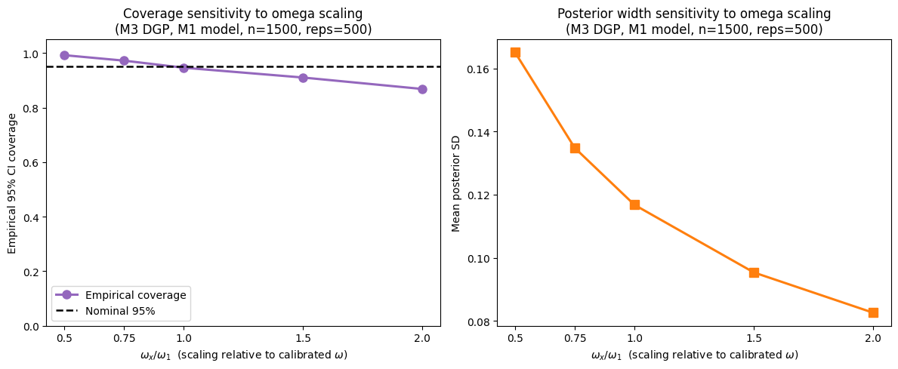
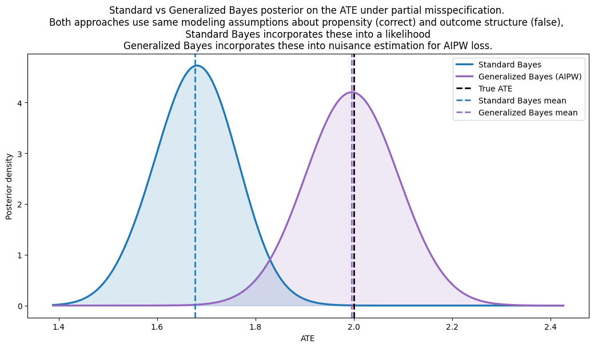
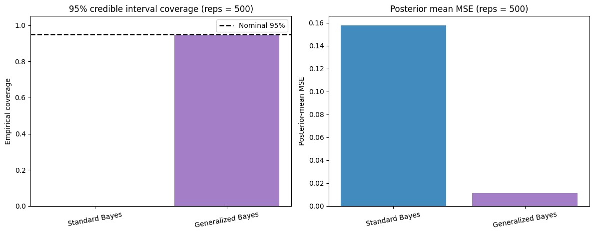

---
---
---

| method            | n_reps | coverage | mse      |
|-------------------|--------|----------|----------|
| Standard Bayes    | 500    | 0.000    | 0.157833 |
| Generalized Bayes | 500    | 0.946    | 0.011459 |

---
---
---

| Semi-synthetic dataset (IHDP) | Coverage (IHDP100) | Coverage(IHDP1000)
|---|---|---|
| AIPW | 0.980 [0.930, 0.998] | 0.991 [0.983, 0.996]
| IPW  | 0.960 [0.901, 0.989] | 0.941 [0.925, 0.955]
| RA   | 0.230 [0.152, 0.325] | 0.279 [0.251, 0.308]